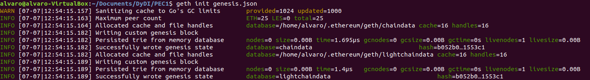

## PEC 1

###  Ejercicio 1 Construir una Blockchian propia a partir un archivo génesis.

1.- Se ha generado un archivo [genesis.json](genesis.json) a partir del ejemplo disponible en la web de documentación de geth [https://github.com/ethereum/go-ethereum](https://github.com/ethereum/go-ethereum)

2.- Se inicializa la blockchain con el comando geth init pasandole como parámetro el archivo genesis.json

