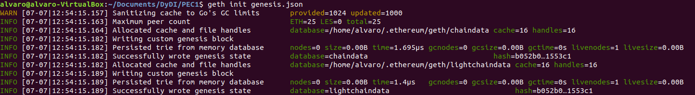
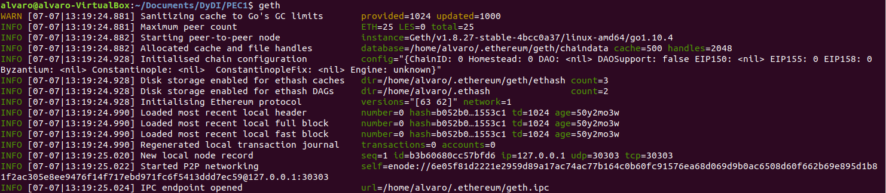
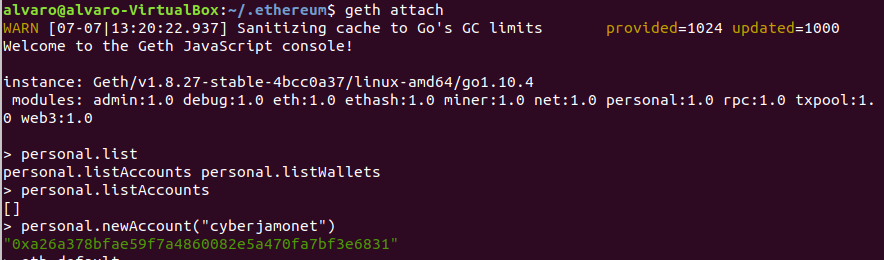
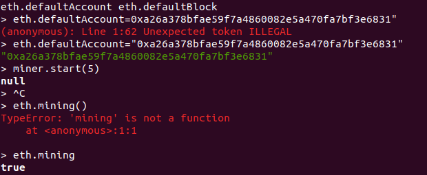
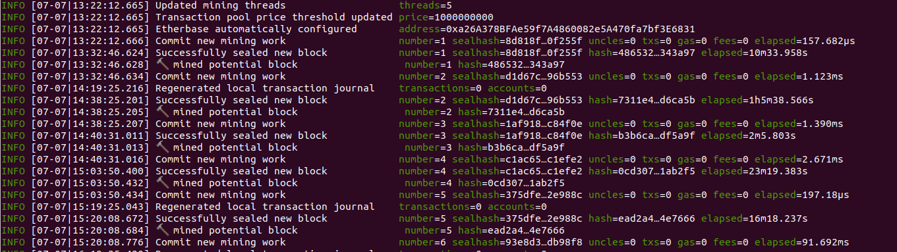
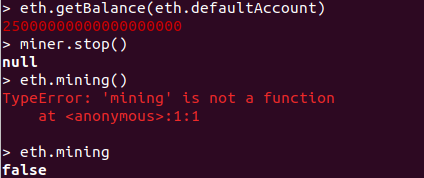

## PEC 1

###  Ejercicio 1 Construir una Blockchian propia a partir un archivo génesis.

1.- Se ha generado un archivo [genesis.json](genesis.json) a partir del ejemplo disponible en la web de documentación de geth [https://github.com/ethereum/go-ethereum](https://github.com/ethereum/go-ethereum)

2.- Se inicializa la blockchain con el comando 
```console
geth init genesis.json 
```
pasandole como parámetro el archivo genesis.json


3.- A continuación se arranca el nodo de la blockchain con el comando 
```console
geth
```


4.- Una vez arrancada la blockchain abrimos otro terminal para ejecutar el comando
```console
geth attach 
```
que nos permite interacturar con el nodo de la blockchain. Una vez ejecutada la consola creamos una cuenta nueva con el comando 
```console
personal.newAccount
```


5.- Establecemos la nueva cuenta como la cuenta por defecto del sistema con el comando 
```console
eth.defaultAccount 
```
donde se despositarán las recompensas del minado y a continuación iniciamos el proceso de minado ejecutando 5 hilos con el comando 
```console
miner.start(5)
```



6.- Por último confirmamos en el terminal donde se está ejecutando el nodo de la blockchain si se ha minado algun bloque válido que proporcione recompensa en la cuenta generada en el punto 4.


7.- Confirmamoos con el comando 
```console
eth.getBalance(eth.defaultAccount) 
```
que se ha recibido la recompensa del minado.

