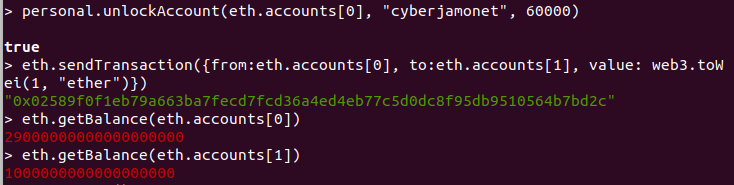

## PEC 1

###  Ejercicio 2 Realizar transferencias con geth y truffle

#### GETH

1.- Para realizar la transferencia con el cliente geth, debe estar ejecutandose el nodo de la blockchain creada en el ejercicio 1 y estar minando para confirmar la transfernecia.
Los comandos utilizados para realizar la transacciones son los siguientes:

1.1- Se desbloquea el acceso a la cuenta que va a realizar la transacción con el comando 
```console
personal.unlockAccount(eth.accounts[0], "cyberjamonet", 60000) 
```
donde se proporciona en los parámetros pasados a la función la dirección de la cuenta, la contraseña de desbloqueo y el tiempo que estará desbloqueado.

1.2- Se realiza la transacción con el comando 
```console
eth.sendTransaction({from:eth.accounts[0], to:eth.accounts[1], value: web3.toWei(1, "ether")}) 
```
donde se le indica la dirección de origen y destino y la cantidad a traspasar.

1.3- Se comprueba con el comando 
```console
eth.getBalance(eth.account[]) 
```
los balances de las cuentas involucradas en la transferencia



#### TRUFFLE

2.- Para realizar la transferencia 
