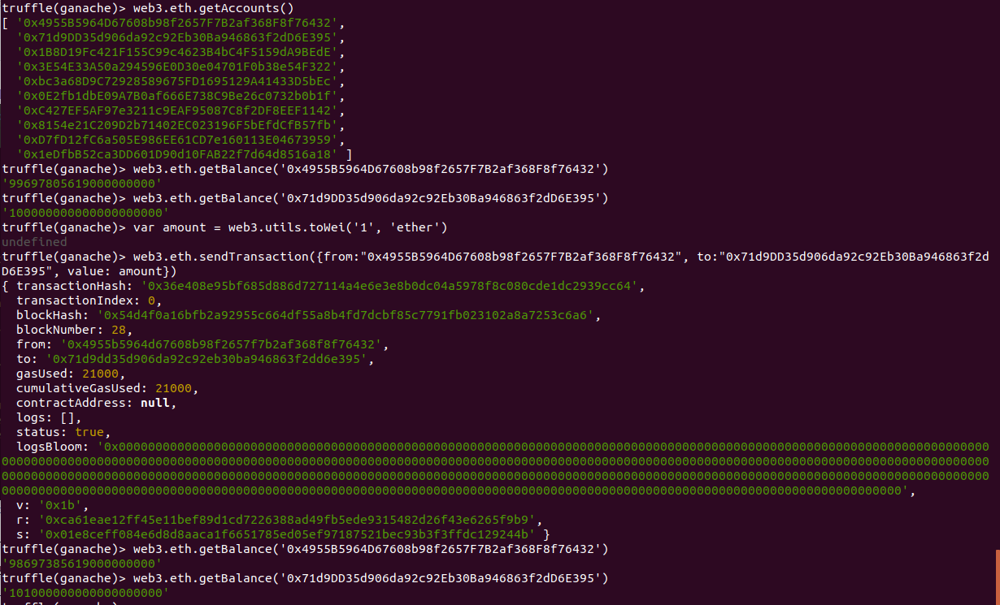

## PEC 1

###  Ejercicio 2 Realizar transferencias con geth y truffle

#### GETH

1.- Para realizar la transferencia con el cliente geth, debe estar ejecutandose el nodo de la blockchain creada en el ejercicio 1 y estar minando para confirmar la transfernecia.
Los comandos utilizados para realizar la transacciones son los siguientes:

1.1- Se desbloquea el acceso a la cuenta que va a realizar la transacción con el comando 
```console
personal.unlockAccount(eth.accounts[0], "cyberjamonet", 60000) 
```
donde se proporciona en los parámetros pasados a la función la dirección de la cuenta, la contraseña de desbloqueo y el tiempo que estará desbloqueado.

1.2- Se realiza la transacción con el comando 
```console
eth.sendTransaction({from:eth.accounts[0], to:eth.accounts[1], value: web3.toWei(1, "ether")}) 
```
donde se le indica la dirección de origen y destino y la cantidad a traspasar.

1.3- Se comprueba con el comando 
```console
eth.getBalance(eth.account[]) 
```
los balances de las cuentas involucradas en la transferencia


#### TRUFFLE

2.- Para realizar la transferencia utilizamos el cliente Truffle utilizado en la práctica anterior a la PEC 1 basada en la Pete's Pet Shop, junto con la blockchain Ganache. Para ellos ejecutamos primero la aplicación Ganache con el workspace creado para la aplicación Pete's Pet Shop donde ya hay creadas varias cuentas de la blockchain con cŕédito. Por otro lado ejecutamos el comando 
```console
truffle console
```
que nos permitirá interactuar con la blockchain de ganache mediante comandos de terminal. 

2.1.- Ejecutamos el comando 
```console
web3.eth.getAccounts()
```
para obtener el listado de las cuentas creadas en la blockchain.

2.2.- Seleccionamos las dos primeras y utilizamos la función 
```console
web3,eth.getBalance(<account>)
```
para poder comprobar la cantidad de crédito de la que dispone cada cuenta.

2.3.- Creamos la variable
```console
var amount = web3.utils.toWei(1, 'ether')
```
que será pasada posteriormente por parámetro en el comando utilizado para hacer la transacción.

2.4.- Realizamos la transferencia con el comando 
```console
web3.eth.sendTransaction({from: "0x4955B5964D67608b98f2657F7B2af368F8f76432", to: "0x71d9DD35d906da92c92Eb30Ba946863f2dD6E395", value. amount})
```

2.5.- Por último comprobamos de nuevo con el comando 
```console
web3,eth.getBalance(<account>)
```
que la transferencia se ha realizado correctamente

