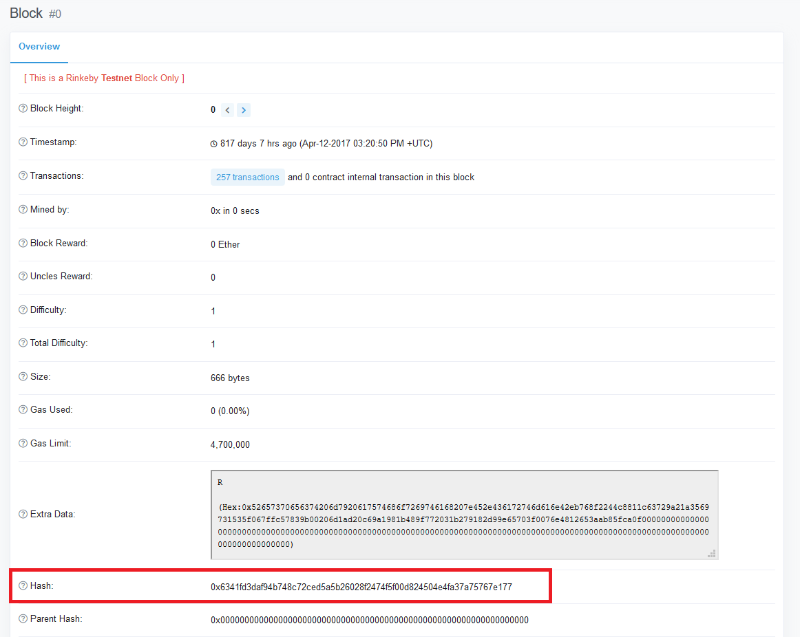
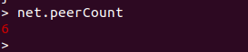
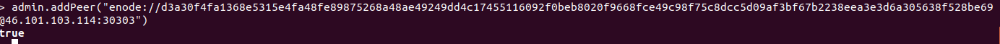

## PEC 1

###  Ejercicio 3 Operar con la red Rinkeby

Para ejecutar un nodo de la red Rinkeby ejecutamos el comando ```console geth --rinkeby ``` y una vez sincronizada toda la blockchain podemos empezar a interactuar con ella a través del nodo. Para ello abrimos un nuevo terminal donde ejecutamos el comando ```console geth --rinkeby console ``` 

1.- Para obtener la dirección hash del bloque génesis mediante consola sin utilizar la función getBlock se pude usar el comando ```console admin.nodeInfo ``` y dentro del campo génesis podremos obtener la dirección del bloque.


Comprobamos en un explorador de bloques el bloque génesis para verificar que coincide con el obtenido en la línea de comandos.


2.- Para obtener el número de nodos se ejecuta el sigueitne comando ```console net.peerCount ```


3.- Para obtener la información a cerca de los peers se ejecuta el siguiente comando que devuelve el listado de peers conectados. 
```console
> admin.peers
[{
    caps: ["eth/62", "eth/63"],
    enode: "enode://803530c373dc4d59eeedbbad99597f9a8a294199ca89941ce3dbbdfe95821e1f2190d73e5d927879f88ed9bde2d9d7504fa46a7e5c6cd6b3ad251b8e62bebeba@35.165.192.94:30303",
    id: "00dc3561490567bc9ea89ca447778f04c16135918e58c8576f2a38cfd403bf24",
    name: "Geth/v1.8.27-stable-4bcc0a37/linux-amd64/go1.11.9",
    network: {
      inbound: false,
      localAddress: "10.0.2.15:39414",
      remoteAddress: "35.165.192.94:30303",
      static: false,
      trusted: false
    },
    protocols: {
      eth: {
        difficulty: 8611289,
        head: "0x75f7198462d3bc59366667f165e9c163f6edddf4c5accbd4a90fd0dd53cd0723",
        version: 63
      }
    }
}, {
    caps: ["eth/62", "eth/63"],
    enode: "enode://343149e4feefa15d882d9fe4ac7d88f885bd05ebb735e547f12e12080a9fa07c8014ca6fd7f373123488102fe5e34111f8509cf0b7de3f5b44339c9f25e87cb8@52.3.158.184:30303",
    id: "1aabba770181eef1b399df4e4177cfc797a1ef5efb0bf961f455c6cab30bee5f",
    name: "Geth/v1.9.0-unstable-fd072c2f-20190626/linux-amd64/go1.12",
    network: {
      inbound: false,
      localAddress: "10.0.2.15:34324",
      remoteAddress: "52.3.158.184:30303",
      static: false,
      trusted: false
    },
    protocols: {
      eth: {
        difficulty: 8611279,
        head: "0x016a9049ca9ab8d5f4b05fd723c9a669696e806694605709f045cbbc6fdbf59b",
        version: 63
      }
    }
}, {
    caps: ["eth/63", "les/2", "les/3"],
    enode: "enode://b6b28890b006743680c52e64e0d16db57f28124885595fa03a562be1d2bf0f3a1da297d56b13da25fb992888fd556d4c1a27b1f39d531bde7de1921c90061cc6@159.89.28.211:30303",
    id: "56483dbe3073c57241c3f128a6ca1c4018347cc0afd0ea1db6773c7e2794698b",
    name: "Geth/v1.9.0-unstable-e4a1488b-20190624/linux-amd64/go1.12.6",
    network: {
      inbound: false,
      localAddress: "10.0.2.15:60188",
      remoteAddress: "159.89.28.211:30303",
      static: false,
      trusted: false
    },
    protocols: {
      eth: {
        difficulty: 8611295,
        head: "0x8cbffdd33a7c67ef8c6e341eeed27ab5d13df8469c230db73996d9aa1352254f",
        version: 63
      }
    }
}, {
    caps: ["eth/62", "eth/63"],
    enode: "enode://5656299dcd77942dca261fe5f9820bc6878b514a7d9250169b49cfe6f3212d72b0278ba76ff25c6ffa9c10faededa28c2c0c94ce1d1135165e6f067601bcd604@34.205.74.142:30303",
    id: "8b46d2dde6083c673e8ba7ee203ea29bfe67101e53241c91696e0398cbff572a",
    name: "Geth/v1.8.25-omnibus-c41559d0/linux-amd64/go1.11.1",
    network: {
      inbound: false,
      localAddress: "10.0.2.15:55064",
      remoteAddress: "34.205.74.142:30303",
      static: false,
      trusted: false
    },
    protocols: {
      eth: {
        difficulty: 8611279,
        head: "0x016a9049ca9ab8d5f4b05fd723c9a669696e806694605709f045cbbc6fdbf59b",
        version: 63
      }
    }
}, {
    caps: ["eth/62", "eth/63"],
    enode: "enode://aabec14c679a6ba9819a67473e6a9714518183e683d1090f818c8fecfc81729ac506d1169987ce0505a05b3e6cd67f6b975495d8dae090110736147e816a916d@13.95.18.219:30309",
    id: "8fe92bdbd1ee2e5beb3a1868af2f49a6624f0aecfa76bf8173efea476442cba0",
    name: "Geth/v1.8.23-stable-c9427004/linux-amd64/go1.11.5",
    network: {
      inbound: false,
      localAddress: "10.0.2.15:55728",
      remoteAddress: "13.95.18.219:30309",
      static: false,
      trusted: false
    },
    protocols: {
      eth: {
        difficulty: 7948873,
        head: "0x1a9d4c98ffc41dbbc903fc1b19980dd79c53f02c0c6f27afaaa0c87a1a135590",
        version: 63
      }
    }
}, {
    caps: ["eth/62", "eth/63"],
    enode: "enode://de5c93a4fa8b4aa5e4bba856b83f5cedb1898db3c6b755335bcf1cda3a65e30b44ccfccce80d4f3e8bf0b6d2256e5fcd73d59e8892da99ab2990f7199f10c3a8@206.189.64.101:30303",
    id: "a5672631ba3eceb453a8eaced9114856aed9bb4896b48debf95fb2f35f56b55c",
    name: "Geth/v1.8.27-stable-4bcc0a37/linux-amd64/go1.10.4",
    network: {
      inbound: false,
      localAddress: "10.0.2.15:51600",
      remoteAddress: "206.189.64.101:30303",
      static: false,
      trusted: false
    },
    protocols: {
      eth: {
        difficulty: 8611291,
        head: "0x435f4a1d4b3fa5eba847fd011c88f97220d5eb9e7a1c58e3c34b3c5fc4d43ce5",
        version: 63
      }
    }
}, {
    caps: ["eth/63"],
    enode: "enode://3d46cf51d2ab5f85f65a6439212c14fc5d05da373ca4592f13dfc6b9ddb7287a8f8e4f3134ff7ac9513aa5584fdeffd71c81c982239fe500d7b8a4b4709e635d@114.108.130.114:30303",
    id: "e35b61f85554ade8e9da9182fdecb07b40035a85d9e13426144c8f93b473b8bd",
    name: "Geth/v1.8.27-stable/linux-amd64/go1.11.5",
    network: {
      inbound: false,
      localAddress: "10.0.2.15:44970",
      remoteAddress: "114.108.130.114:30303",
      static: false,
      trusted: false
    },
    protocols: {
      eth: {
        difficulty: 8611289,
        head: "0x75f7198462d3bc59366667f165e9c163f6edddf4c5accbd4a90fd0dd53cd0723",
        version: 63
      }
    }
}, {
    caps: ["eth/62", "eth/63"],
    enode: "enode://d3a30f4fa1368e5315e4fa48fe89875268a48ae49249dd4c17455116092f0beb8020f9668fce49c98f75c8dcc5d09af3bf67b2238eea3e3d6a305638f528be69@46.101.103.114:30303",
    id: "e5ce8bf8588345ed909813dab9df59ce57f859a171cc65dc97d1603d4c0bb4b0",
    name: "Geth/v1.8.27-stable-4bcc0a37/linux-amd64/go1.10.4",
    network: {
      inbound: false,
      localAddress: "10.0.2.15:52338",
      remoteAddress: "46.101.103.114:30303",
      static: false,
      trusted: false
    },
    protocols: {
      eth: {
        difficulty: 8611289,
        head: "0x75f7198462d3bc59366667f165e9c163f6edddf4c5accbd4a90fd0dd53cd0723",
        version: 63
      }
    }
}]
```
Dentro de la información proporcionada de cada peers está el campo head en el que se indica cual es el último bloque validado por el peer.

4.- Para añadir un bootnode de manera manual se ejecuta el comando ```console admin.addPeer(<hash node>) ```


