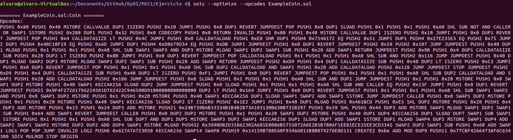
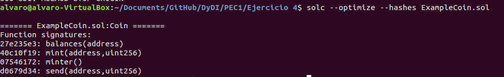
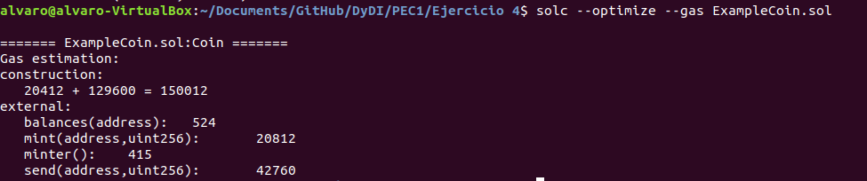

## PEC 1

###  Ejercicio 4 Compilador de Solidity

Para realizar el ejercicio se instala el compilador de Solidity con los siguietnes comandos 
```console
sudo add-apt-repository ppa:ethereum/ethereum
sudo apt-get update
sudo apt-get install solc
``` 
A continuación se va a compilar el siguiente Smart Contract [ExampleCoin.sol](ExampleCoin.sol) para obtener la siguiente información: 


1.- Códigos de operación del contrato inteligente.


2.- Identificadores de las funciones que existan dentro del contrato inteligente


2.- Estimación del gas utilizado por cada función 

