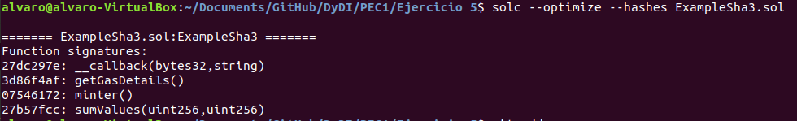

## PEC 1

###  Ejercicio 5 Obtener identificadores de funciones sin el compilador de Solidity

Para obtener los identificadores de las siguientes funciones, según la [https://solidity.readthedocs.io/en/latest/abi-spec.html#function-selector-and-argument-encoding](documentación de solidity), en que estos son obtenidos de la aplicación una funcón hash sha3 al nombre de la funcion y al tipo de paramétros que se pasan a esta.
Una vez aplicada la función hash se obtienen los 4 primeros bytes del código ASCII del resultado de la función.

Para obtener las funciones ejecutamos una consola con la aplicación geth con el siguiente comando
```console
geth console
```
Una vez en la consola se ejecutan los siguientes comandos para obtener los identificadores.

1.- Identificador de la función function sumValues (uint _a, uint _b) public view returns (uint _c) {}
```console
web3.sha3("sumValues(uint256,uint256)")
"0x27b57fcc13dafc8e83ae46798da0c4c32ac0b86c1f24ef37538b0fc8b50875f8"
``` 
Por lo tanto el identificador es **27b57fcc**

2.- Identificador de la función function getGasDetails() public payable{}
```console
web3.sha3("getGasDetails()")
"0x3d86f4af2d0b73fb4f46e0f668f472b5ea2669e6c34cf4e04648d8bc930a8395"
``` 
Por lo tanto el identificador es **3d86f4af++

3.- Identificador de la función function __callback(bytes32 id, string memory result) public{}
```console
web3.sha3("__callback(bytes32,string)")
"0x27dc297eab4e0fe19b1c27421a866f28afc57b7f56076d987944d10e83b1a57d"
``` 
Por lo tanto el identificador es **27dc297e**

4.- Identificador de la función function function alm(uint8 _a, address _address) internal{}
```console
web3.sha3("alm(uint8,address)")
"0x47300c4272c7e7b2cfb486765306204808c36a9c23dd7223a2348cb07b39feab"
```
Por lo tanto el identificador es **47300c42**

En la siguiente captura se puede ver los resultado obtenidos. 


Para hacer una comparación de los identificadores de las funciones obtenidos con el compilador de Solidity, se crea un Smart Contract para poder ser compilado
El Smart Contract es el siguiente 
```console
pragma solidity >=0.5.0 <0.7.0;

contract ExampleSha3 {
    // The keyword "public" makes variables
    // accessible from other contracts
    address public minter;

    // Constructor code is only run when the contract
    // is created
    constructor() public {
        minter = msg.sender;
    }

    function sumValues (uint _a, uint _b) public view returns (uint _c) {}
    function getGasDetails() public payable{}
    function __callback(bytes32 id, string memory result) public{}
    function alm(uint8 _a, address _address) internal{}
}
```
Para comprobar los identificadores del Smart Contract se ejecuta el siguiente comando
```console
solc --optimize --hashes ExampleSha3.sol
```



En los resultados de la compilación se pueden comprobar todas las funciones a excepción de la función alm que es del tipo internal y por lo tanto no es incluido en los resultados del compilador.

