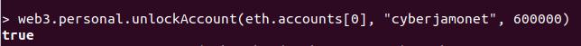
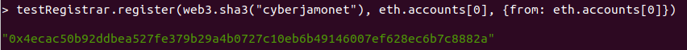
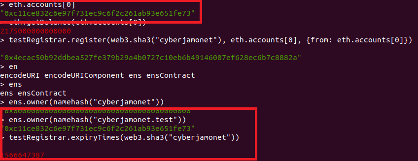

## PEC 2

###  Ejercicio 1 Adquiera un dominio bajo el TLD ‘.test’ en la testnet Rinkeby.

1.- Se ejecuta un nodo de Rinkeby con la aplicación geth y el siguiente comando para sincronizar los bloques
```console
geth --rinkeby
```

2.- Descargamos el archivo [ensutils-testnet.js](https://github.com/ensdomains/ens/blob/master/ensutils-testnet.js) y modificamos la línea 220 con el siguiente comando que indica la dirección del contrato de ENS bajo Rinkeby
```console
var ens = ensContract.at('0xe7410170f87102df0055eb195163a03b7f2bff4a');
```
renombramos el archivo modificado a [ensutils-rinkeby.js](ensutils-rinkeby.js)

3.- Una vez sincronizada la blockchain abrimos otro terminal para ejecutar el comando
```console
geth -rinkeby attach 
```
que nos permite interacturar con el nodo de la blockchain. Una vez ejecutada la consola cargamos el archivo ensutils-rinkeby.js con el comando 
```console
loadScript("/home/alvaro/ens/ensutils-rinkeby.js")
```
A continuación comprobamos que se ha cargado correctamente el archivo javascript comprobando la disponibilidad del nombre que queremos reservar en ENS con el comando
```console
testRegistrar.expiryTimes(web3.sha3("cyberjamonet"))
```

![Captura 1(Pantallazos/LoadScript.png "Captura 1")

4.- Desbloqueamos la cuenta con el comando
```console
web3.personal.unlockAccount(eth.accounts[0], "cyberjamonet", 600000)
```



5.- Una vez desbloqueada la cuenta a la que vamos a asociar a la reserva del dominio cyberjamonet.test ejecutamos el siguiente comando 
```console
testRegistrar.register(web3.sha3("cyberjamonet"), eth.accounts[0], {from: eth.accounts[0]})
```



6.- Finalmente comprobamos que se ha realizado el registro correctamente con los comandos 
```console
ens.owner(namehash("cyberjamonet.test"))
```
```console
testRegistrar.expiryTimes(web3.sha3("cyberjamonet"))
```


