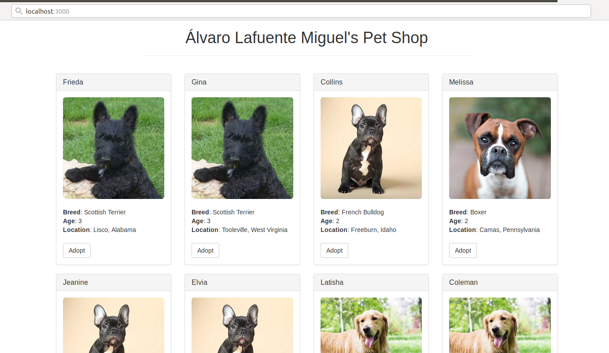
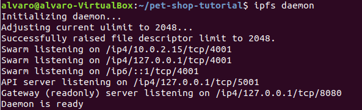
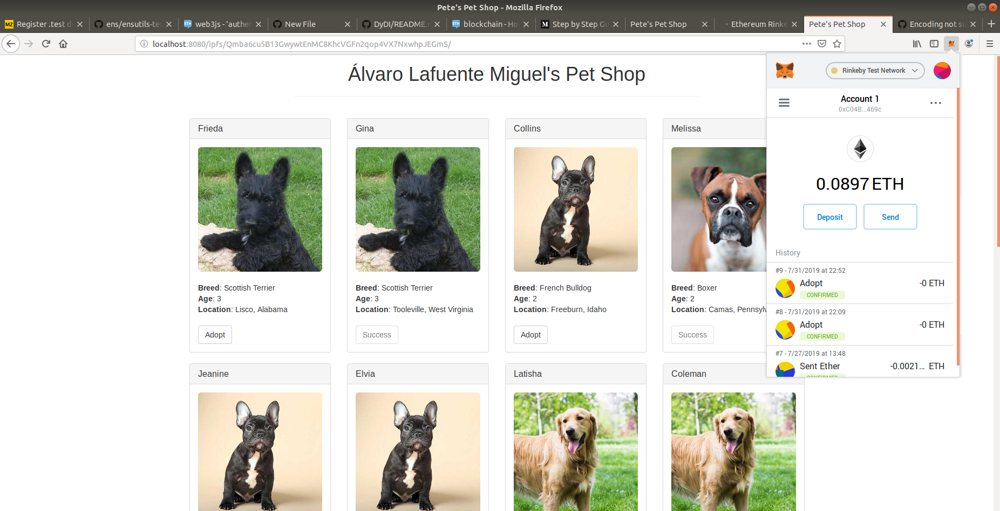

## PEC 2

###  Ejercicio 2 Desplegar una Dapp en IPFS con la red testnet Rinkeby.

1.- Se modifica el archivo index.html, ubicado en la carpeta src de la aplicación. Se realizan los cambios en la línea 24 para modificar el título de la aplicación Álvaro Lafuente Miguel' Pet Shop 
```console
<h1 class="text-center">Álvaro Lafuente Miguel's Pet Shop</h1>
```

2.- Para poder usar la red Rinkeby para la ejecución de la Dapp Álvaro Lafuente Miguel' Pet Shop con geth hay que modificar el archivo truffle-config.js ubicado en la carpeta raiz de la aplicación.
```console
module.exports = {
  // See <http://truffleframework.com/docs/advanced/configuration>
  // for more about customizing your Truffle configuration!
  networks: {
    development: {
      host: "127.0.0.1",
      port: 7545,
      network_id: "*" // Match any network id
    },
    rinkeby: {
      host: "localhost", // Connect to geth on the specified
      port: 8545,
      network_id: 4
    },
    develop: {
      port: 8545
    }
  }
};
```

3.- A continuación se migra el proyecto con la ayuda de los script contenidos en el proyecto en la carpeta migrations (1_initial_migration.js y 2_deploy_contracts.js).
Para realizar este paso primero hay que comprobar que la cuenta encargada de gestionar la instancia en ejecución del nodo de Geth que vamos a utilizar tiene fondos. Para realizar la comprobación ejecutamos el siguiente comando
```console
eth.getBalance(eth.accounts[0])
```
Si la consola nos devuelve que hay fondos suficientes se puede proceder con el siguiente paso, sino nos podemos ayudar de un faucet de la red Rinkeby para lograr fondos en la cuenta eth.accounts[0]

Una vez confirmado la existencia de fondos suficientes desde el directorio raiz de la aplicación que se va a migrar se ejecuta el siguiente comando

```console
truffle migrate --network=rinkeby
```

```console
> Warning: possible unsupported (undocumented in help) command line option: --network=rinkeby

Compiling your contracts...
===========================
> Everything is up to date, there is nothing to compile.


Migrations dry-run (simulation)
===============================
> Network name:    'rinkeby-fork'
> Network id:      4
> Block gas limit: 0x6adab6


1_initial_migration.js
======================

   Deploying 'Migrations'
   ----------------------
   > block number:        4831413
   > block timestamp:     1564601113
   > account:             0xC11CE832C6E97F731eC9C6F2c261ab93E651fE73
   > balance:             0.201612116
   > gas used:            246393
   > gas price:           2 gwei
   > value sent:          0 ETH
   > total cost:          0.000492786 ETH

   -------------------------------------
   > Total cost:         0.000492786 ETH


2_deploy_contracts.js
=====================

   Deploying 'Adoption'
   --------------------
   > block number:        4831415
   > block timestamp:     1564601113
   > account:             0xC11CE832C6E97F731eC9C6F2c261ab93E651fE73
   > balance:             0.201082936
   > gas used:            237567
   > gas price:           2 gwei
   > value sent:          0 ETH
   > total cost:          0.000475134 ETH

   -------------------------------------
   > Total cost:         0.000475134 ETH


Summary
=======
> Total deployments:   2
> Final cost:          0.00096792 ETH


Starting migrations...
======================
> Network name:    'rinkeby'
> Network id:      4
> Block gas limit: 0x6adab6


1_initial_migration.js
======================

   Deploying 'Migrations'
   ----------------------
   > transaction hash:    0x1a4f47bd0b594e11184412766fad844076ac2a442e9c1d2637e8ecc6e030795e
   > Blocks: 1            Seconds: 16
   > contract address:    0xF33b014DD6E64a5F516e4C2c9901169BacDa5f7f
   > block number:        4831413
   > block timestamp:     1564601131
   > account:             0xC11CE832C6E97F731eC9C6F2c261ab93E651fE73
   > balance:             0.196877042
   > gas used:            261393
   > gas price:           20 gwei
   > value sent:          0 ETH
   > total cost:          0.00522786 ETH


   > Saving migration to chain.
   > Saving artifacts
   -------------------------------------
   > Total cost:          0.00522786 ETH


2_deploy_contracts.js
=====================

   Deploying 'Adoption'
   --------------------
   > transaction hash:    0xe4789b9f4176561b477c44f7befa6afd2af6f393dc1633598be3f50422dc9b96
   > Blocks: 0            Seconds: 12
   > contract address:    0xF64bcD80a1090b6cD43D63C6a810f7164529BAd6
   > block number:        4831415
   > block timestamp:     1564601161
   > account:             0xC11CE832C6E97F731eC9C6F2c261ab93E651fE73
   > balance:             0.191285242
   > gas used:            237567
   > gas price:           20 gwei
   > value sent:          0 ETH
   > total cost:          0.00475134 ETH


   > Saving migration to chain.
   > Saving artifacts
   -------------------------------------
   > Total cost:          0.00475134 ETH


Summary
=======
> Total deployments:   2
> Final cost:          0.0099792 ETH
```
Comprobamos que la aplicación se ha migrado correctamente a la red Rinkeby ejecutando un servidor web local para lanzar una instancia de la aplicación desde su carpeta raiz con el siguiente comando.
```console
npm run dev
```


4.- A continuación se integrará la aplicación en IPFS y para ello se han de mover el fichero Adoptions.json de la carpeta build/contracts a la carpeta src que es la que se publicará en IPFS. De esta forma los archivos js que referencien a este archivo dentro IPFS tendrán acceso a él.
En el siguiente paso abrimos un terminal para ejecutar un nodo ipfs
```console
ifps daemon
```


En paralelo abrimos otro terminal donde ejecutamos el siguiente comando desde la carpeta raiz de la aplicación Álvaro Lafuente Miguel' Pet Shop 
```console
alvaro@alvaro-VirtualBox:~/Documents/GitHub/DyDI/PEC2/Ejercicio 2/pet-shop-tutorial/src$ ipfs add -r .
added Qma3DGxzXm3886La4oSmG2UcWz6RH8Xbh3z8nzZZZ8kDHh src/Adoption.json
added QmYUaCPwvJWiueRXFSTTv8vdedWWzRhRdn8RMw35e7k67u src/css/bootstrap.min.css
added QmbrzMumAwEPCoLs6jBdDyHz2TBjpkSFhcCHMT7fBsdFyr src/css/bootstrap.min.css.map
added QmWhoNhVUb9bcjuKLB259VYogJpPsJaAe8dern9LK95tVN src/fonts/glyphicons-halflings-regular.eot
added QmbcbjLEC1aHy4j2qvtncevjenYwHjEF4qZ2kK5pRJzDLg src/fonts/glyphicons-halflings-regular.svg
added QmciDEkreBpY2S6Ktg1Zarbsx5K2DmHK59H261Bjr2fnuR src/fonts/glyphicons-halflings-regular.ttf
added QmaYEdLkMnEHVN8HZB2GGETottySZoHh3TnYZERke36PVr src/fonts/glyphicons-halflings-regular.woff
added QmUbUsBQbjJhm5iYba5jqibRr4A6gG3HVczSy5gs5PrMhY src/fonts/glyphicons-halflings-regular.woff2
added QmacvUkwHXqjqaHevcNXRvTHompuCSXgTwFRxp2yWJQJah src/images/boxer.jpeg
added QmcCkw63o2kTaMwHhuUtqZ9cqX7rbVGv9wFJD5nwaXkWPv src/images/french-bulldog.jpeg
added Qmaj7LUwb7T5sMFyznMGS1cAGPyVJL6Vhjwemq4zb1Nbex src/images/golden-retriever.jpeg
added QmT3m9b5UDTr9gKgN1xKQfS5fSKAx8AdZCJ1XJxJTii29m src/images/scottish-terrier.jpeg
added QmZ69XE8WEDCcykhxkNoUpHtfYT4knpgNdvBCEzzerMC68 src/index.html
added Qmf4VUM7s51Dvpo9APJPxafyjQNy2E6vstRnDkARx3GetT src/js/app.js
added QmNXRFREw7waGtKW9uBUze3PkR9E12HeeAQSkZQSiFUJqo src/js/bootstrap.min.js
added QmZQp29tbdppjqyixxM8L8NjsG4paN4eVW9GxZYicXov9v src/js/truffle-contract.js
added QmdTtsVM7KtvycQ68f9M43N4EQKvbd58q8aeAhP2fMz4Di src/js/web3.min.js
added QmZKHAuYoeAjHqfhi2jJaELDfMBj6dtydz7UsZv3BPaon8 src/pets.json
added QmQfwrATTrJc1aTN1dVu9K7nQ5rw67np8yg46EvAbqKEZw src/css
added Qmb3fJpXVGvUnNeRLC3P5sTXMzjpf5zq4tKt9XjhtYFf1k src/fonts
added QmQo4AjSx9JkNsHa3nRqxtryx6iGHmqGprhm2ic2MztW3Y src/images
added QmcvCwv38SUbbxJ2UMkHPCy74e2QAzg7NU9nKyYipEZ2S1 src/js
added Qmba6cu5B13GwywtEnMC8KhcVGFn2qop4VX7NxwhpJEGmS src
```
Obteniendo como identifador hash del directorio raiz **``Qmba6cu5B13GwywtEnMC8KhcVGFn2qop4VX7NxwhpJEGmS``**

Para comprobar que funciona correctamente cargamos la siguiente url http://localhost:8080/ipfs/Qmba6cu5B13GwywtEnMC8KhcVGFn2qop4VX7NxwhpJEGmS/
Interactuamos con la aplicación a través de Metamask y probamos a hacer una adopción correctamente, como se puede ver en el pantallazo


5.- Comprobamos desde una url pública de IPFS si se ha realizado la carga correctamente https://ipfs.io/ipfs/Qmba6cu5B13GwywtEnMC8KhcVGFn2qop4VX7NxwhpJEGmS/
