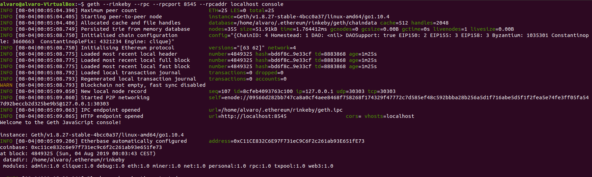

## PEC 2

###  Ejercicio 3 Crear una web básica y compartirlo con Swarm usando el cifrado disponible

1.- Se ejecuta un nodo de Rinkeby con la aplicación geth y el siguiente comando para sincronizar los bloques
```console
geth --rinkeby --rpc --rpcport 8545 --rpcaddr localhost console
```


2.- Se crea el fichero index.html básico junto con los dos documentos que enlazará para hacer la prueba y que están disponibles en [Ejercicio 3](./)
A continuación se ejecuta una instacia del demonio Swarm en la que se debe indicar una cuenta de Ethereum con la que interactuará con la EVM a través del nodo de la aplicación geth que se está ejecuntado. Para obtener la cuenta se ejecuta el siguiente comando en la consola de geth
```console
eth.account[0]
```


Una vez obtenida la cuenta de Ethereum el comando que se ejecuta para lanzar la instancia de swarm es el siguiente
```console
swarm --keystore ./.ethereum/rinkeby/keystore/ --bzzaccount c11ce832c6e97f731ec9c6f2c261ab93e651fe73
```
Posteriormente solicitará la contraseña para poder acceder a la cuenta Ethereum pasada como parametro


3.- Una vez está en ejecución el nodo swarm subimos los documentos con el siguiente comando
```console
swarm --recursive --defaultpath "index.html" up --encrypt  ./carpeta_ficheros_web
```


Donde el parametro --recursive le indica que recorra la carpeta pasada como último parámetro de manera recursiva para subir todos los documentos contenidos en ella. 
El parámetro defaulpath indica que el fichero por defecto para mostrar ante una petición del hash resultante es el fichero index.html
El parámetro encrypt indica que utilice la encricptación disponible en swarm

El resultado del comando indicado es el hash del proyecto básico web que en este caso es **``56e37fe1c9be59110db1a87922399bb68d629c29952623078cd6e899fc478a91130446032d298e869be44c298cc1a96b1fec8589a5be5f8ca34a9e9ffe31ba45``**

4.- Se comprueba el hash obtenido en una url para ver si los ficheros se han subido correctamente

http://localhost:8500/bzz:/56e37fe1c9be59110db1a87922399bb68d629c29952623078cd6e899fc478a91130446032d298e869be44c298cc1a96b1fec8589a5be5f8ca34a9e9ffe31ba45


