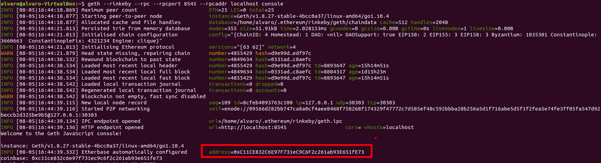
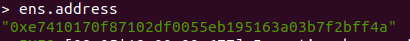
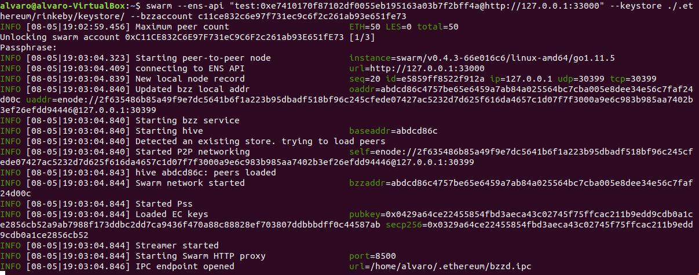
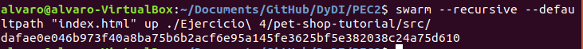
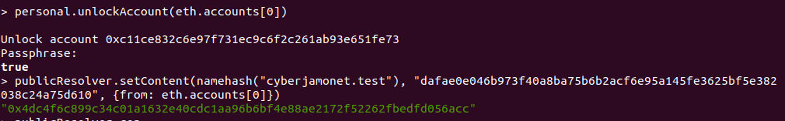
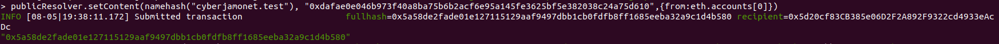
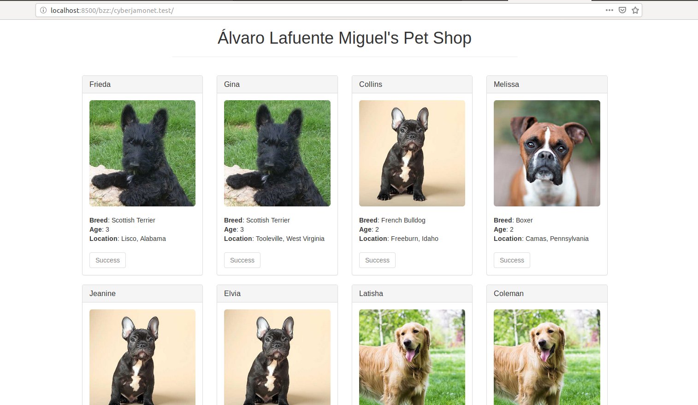
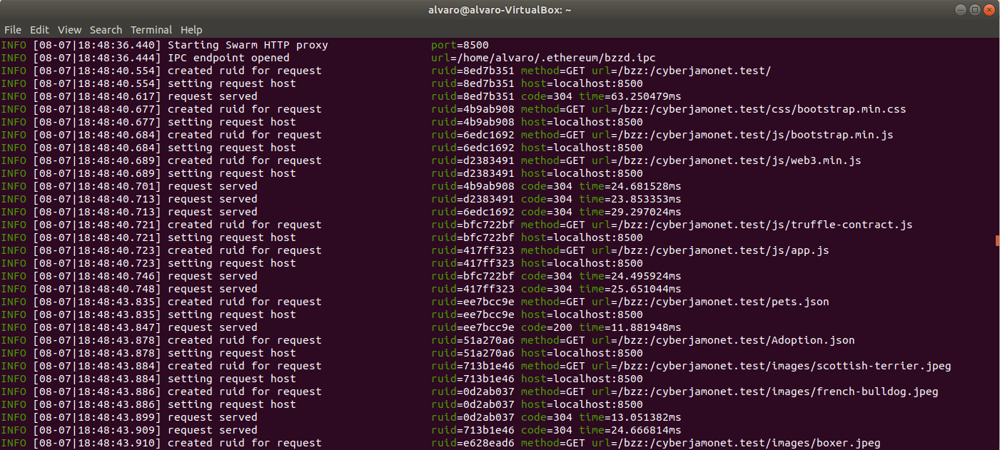
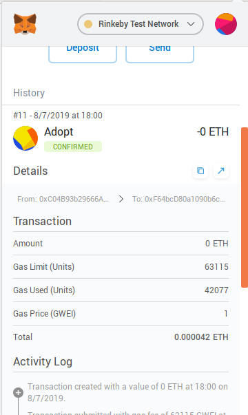

## PEC 2

###  Ejercicio 4 Alojar un proyecto Dapp en Swarm y vincularla con ENS

1.- Se ejecuta un nodo de Rinkeby con la aplicación geth y el siguiente comando para sincronizar los bloques
```console
geth --rinkeby --rpc --rpcport 8545 --rpcaddr localhost console
```

En la imagen se puede ver marcada la dirección de la cuenta que será utilizada para interactuar con la EVM en la ejecución del nodo Swarm y 

2.- Se carga el fichero [ensutils-rinkeby.js](ensutils-rinkeby.js) que permitirá, con sus funciones, interactuar con el contrato ENS de la red Rinkeby, para realizar la carga se ejecuta el siguiente comando 
```console
loadScript("/home/alvaro/ens/ensutils-rinkeby.js")
```

Se comprueba que la dirección del contrato ENS incluido en el fichero ensutils-rinkeby.js es **``0xe7410170f87102df0055eb195163a03b7f2bff4a``**


3.- Se ejecuta una instancia del demonio Swarm con el siguiente comando 
```console
swarm --ens-api "test:0xe7410170f87102df0055eb195163a03b7f2bff4a@http://127.0.0.1:8545" --keystore ./.ethereum/rinkeby/keystore/ --bzzaccount c11ce832c6e97f731ec9c6f2c261ab93e651fe73
```
En la ejecución del comando se pueden distinguir varios parámetros con la siguiente finalidad:
--ens-api indica la dirección del contrato ENS de la red Rinkeby a través del nodo geth ejecutado en la dirección 127.0.0.1:8545
--keystore indica la ruta del almacen de claves privadas del usuario que interactuarán con la EVM
--bzzaccount indica la dirección de la cuenta seleccionada para interactuar con la EVM 
Una vez ejecutado el comando se pide la introducción de la contraseña de la cuenta pasada como parámetro para su desbloqueo, por seguridad


4.- A continuación hay que subir la Dapp del ejercicio 2 con la ayuda de Swarm, para ello se ejecuta el siguiente comando
```console
swarm --recursive --defaultpath "index.html" up ./Documents/GitHub/DyDI/PEC2/Ejercicio\ 4/pet-shop-tutorial/src/
```
En el comando se indica que se recorra de manera recursiva el directorio src de la Dapp subiendo todo el contenido y que el fichero por defecto para la ejecución de la aplicación es index.html.
La ejecución de este comando nos devuelve el hash de la aplicación ```dafae0e046b973f40a8ba75b6b2acf6e95a145fe3625bf5e382038c24a75d610 ```


Se comprueba que la aplicación se ha cargado correctamente con la siguiente url http://localhost:8500/bzz:/dafae0e046b973f40a8ba75b6b2acf6e95a145fe3625bf5e382038c24a75d610/


5.- Por último se ha de enlazar el dominio adquirido en el ejercicio 1 con la aplicación Dapp subida a través de Swarm. Para ello, con la ayuda del siguiente comando se crea un resolver con la ayuda del siguiente comando 
```console
ens.setResolver(namehash('cyberjamonet.test'), publicResolver.address, {from: eth.accounts[0]});
```
En este comando se indica como parámetro el dominio cyberjmonet.test, la dirección del contrato ENS indicado en el archivo ensutils-rinkeby.js y la cuenta que interactuará con la EVM, la cual ha tenido que ser desbloqueada previamente.



A continuación se ejecuta la función setContent de publicResolver donde se le indica el dominio y la dirección hash de la aplicación Dapp subida con Swarm. Previamente se ha tenido que desbloquear la cuenta indicada como tercer parámetro de la función para poder interactuar con la EVM
```console
publicResolver.setContent(namehash('cyberjamonet.test'), "0xdafae0e046b973f40a8ba75b6b2acf6e95a145fe3625bf5e382038c24a75d610", {from: eth.accounts[0]});
```


6.- Se comprueba que la resolución del dominio se está haciendo correctamente, para ello se accede a la siguiente url http://localhost:8500/bzz:/cyberjamonet.test/



En el nodo Swarm ejecutado se puede ver los registros de la resolución hecha.


Se comprueba con Metamask que se puede interactuar con la aplicación para ello probamos a adoptar varios perros de la aplicación.



Se puede comprobar la transacción con id 0xa1cedb6b3565a4ca73dfbdf0b68cb9451bd3306c507ea270e4fdb9a623b80b69 en la siguiente url https://rinkeby.etherscan.io/tx/0xa1cedb6b3565a4ca73dfbdf0b68cb9451bd3306c507ea270e4fdb9a623b80b69
