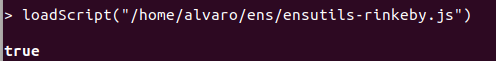
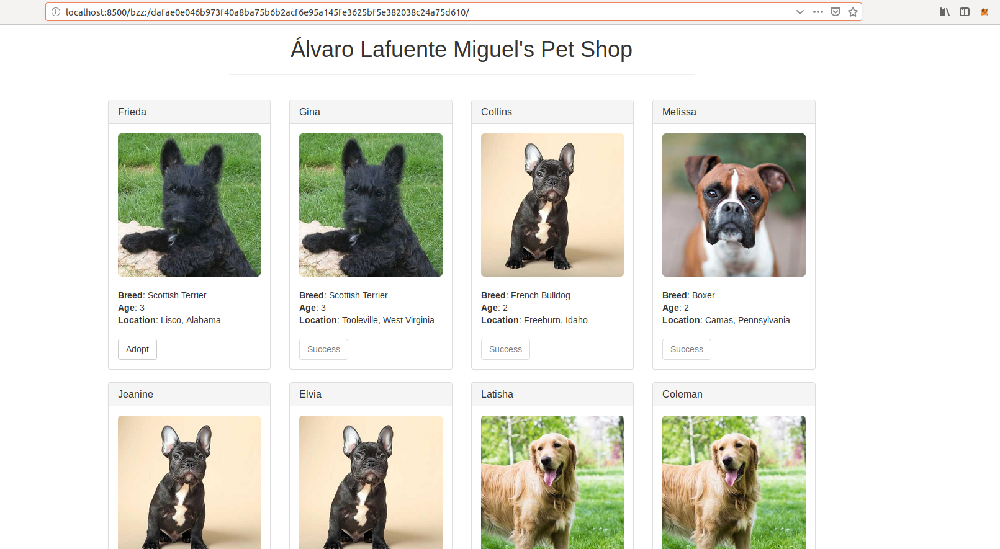

## PEC 2

###  Ejercicio 4 Alojar un proyecto Dapp en Swarm y vincularla con ENS

1.- Se ejecuta un nodo de Rinkeby con la aplicación geth y el siguiente comando para sincronizar los bloques
```console
geth --rinkeby --rpc --rpcport 8545 --rpcaddr localhost console
```

En la imagen se puede ver marcada la dirección de la cuenta que será utilizada para interactuar con la EVM en la ejecución del nodo Swarm y 

2.- Se carga el fichero [ensutils-rinkeby.js](ensutils-rinkeby.js) que permitirá, con sus funciones, interactuar con el contrato ENS de la red Rinkeby, para realizar la carga se ejecuta el siguiente comando 
```console
loadScript("/home/alvaro/ens/ensutils-rinkeby.js")
```

Se comprueba que la dirección del contrato ENS incluido en el fichero ensutils-rinkeby.js es **``0xe7410170f87102df0055eb195163a03b7f2bff4a``**


3.- Se ejecuta una instancia del demonio Swarm con el siguiente comando 
```console
swarm --ens-api "test:0xe7410170f87102df0055eb195163a03b7f2bff4a@http://127.0.0.1:8545" --keystore ./.ethereum/rinkeby/keystore/ --bzzaccount c11ce832c6e97f731ec9c6f2c261ab93e651fe73
```
En la ejecución del comando se pueden distinguir varios parámetros con la siguiente finalidad:
--ens-api indica la dirección del contrato ENS de la red Rinkeby a través del nodo geth ejecutado en la dirección 127.0.0.1:8545
--keystore indica la ruta del almacen de claves privadas del usuario que interactuarán con la EVM
--bzzaccount indica la dirección de la cuenta seleccionada para interactuar con la EVM 
Una vez ejecutado el comando se pide la introducción de la contraseña de la cuenta pasada como parámetro para su desbloqueo, por seguridad


4.- A continuación hay que subir la Dapp del ejercicio 2 con la ayuda de Swarm, para ello se ejecuta el siguiente comando
```console
swarm --recursive --defaultpath "index.html" up ./Documents/GitHub/DyDI/PEC2/Ejercicio\ 4/pet-shop-tutorial/src/
```
En el comando se indica que se recorra de manera recursiva el directorio src de la Dapp subiendo todo el contenido y que el fichero por defecto para la ejecución de la aplicación es index.html.
La ejecución de este comando nos devuelve el hash de la aplicación ```console dafae0e046b973f40a8ba75b6b2acf6e95a145fe3625bf5e382038c24a75d610 ```


Se comprueba que la aplicación se ha cargado correctamente con la siguiente url http://localhost:8500/bzz:/dafae0e046b973f40a8ba75b6b2acf6e95a145fe3625bf5e382038c24a75d610/




Se crea el fichero index.html básico junto con los dos documentos que enlazará para hacer la prueba y que están disponibles en [Ejercicio 3](./)
A continuación se ejecuta una instacia del demonio Swarm en la que se debe indicar una cuenta de Ethereum con la que interactuará con la EVM a través del nodo de la aplicación geth que se está ejecuntado. Para obtener la cuenta se ejecuta el siguiente comando en la consola de geth
```console
eth.account[0]
```


Una vez obtenida la cuenta de Ethereum el comando que se ejecuta para lanzar la instancia de swarm es el siguiente
```console
swarm --keystore ./.ethereum/rinkeby/keystore/ --bzzaccount c11ce832c6e97f731ec9c6f2c261ab93e651fe73
```
Posteriormente solicitará la contraseña para poder acceder a la cuenta Ethereum pasada como parametro


3.- Una vez está en ejecución el nodo swarm subimos los documentos con el siguiente comando
```console
swarm --recursive --defaultpath "index.html" up --encrypt  ./carpeta_ficheros_web
```


Donde el parametro --recursive le indica que recorra la carpeta pasada como último parámetro de manera recursiva para subir todos los documentos contenidos en ella. 
El parámetro defaulpath indica que el fichero por defecto para mostrar ante una petición del hash resultante es el fichero index.html
El parámetro encrypt indica que utilice la encricptación disponible en swarm

El resultado del comando indicado es el hash del proyecto básico web que en este caso es **``56e37fe1c9be59110db1a87922399bb68d629c29952623078cd6e899fc478a91130446032d298e869be44c298cc1a96b1fec8589a5be5f8ca34a9e9ffe31ba45``**

4.- Se comprueba el hash obtenido en una url para ver si los ficheros se han subido correctamente

http://localhost:8500/bzz:/56e37fe1c9be59110db1a87922399bb68d629c29952623078cd6e899fc478a91130446032d298e869be44c298cc1a96b1fec8589a5be5f8ca34a9e9ffe31ba45


